<p align="center">
<br />
<br />
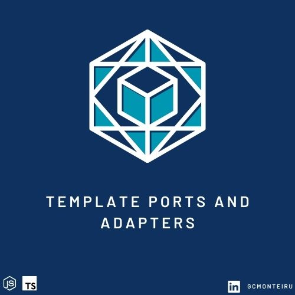
</p>
<p align="center">

<br />
<br />

## Tópicos

1. [ Qual o propósito desse template? ](#qual-o-propósito-desse-template)
2. [ O que é o Hexagonal? ](#o-que-é-o-hexagonal)
3. [ Tecnologia e estruturas ](#tecnologias-e-estruturas)
4. [ Executando o projeto no ambiente local ](#executando-o-projeto-no-ambiente-local)
5. [ Como criar novas features no projeto utilizando o Hexagonal? ](#como-criar-novas-features-no-projeto-utilizando-o-hexagonal)
6. [ Como criar um adaptador primário no projeto utilizando o Hexagonal? ](#como-criar-um-adaptador-primário-no-projeto-utilizando-o-hexagonal)
7. [ Como criar um adaptador secundário no projeto utilizando o Hexagonal? ](#como-criar-um-adaptador-secundário-no-projeto-utilizando-o-hexagonal)
8. [ Padrão de versionamento ](#padrao-de-versionamento)
9. [ Débitos técnicos ](#débitos-técnicos)
10. [ Contribuidores ](#contribuidores)
11. [ Devops ](#devops)

<br />

## Qual o propósito desse template?

O propósito desse template é facilitar a criação de um projeto novo utilizando a arquitetura Ports and Adapters de Alistair Cockburn.

## O que é o Hexagonal?

### Dividimos a nossa estrutura hexágonal em três partes:

Podemos dizer de forma simples que a arquitetura Hexagonal se divide em três partes, são elas:

1. Centro do hexágono
2. Lado esquerdo do hexágono (Adaptadores primários)
3. Lado direito do hexágono (Adaptadores secundários)

### No centro do hexágono:

No centro do hexágono temos concentrado toda a camada da aplicação, que por si só representa as regras de negócio e os modelos do negócio. Essa camada tem por intenção ser isolada das demais, para que a regra de negócio se mantenha intacta

### Ao lado direito, adaptadores secundários:

Os adaptadores secundários representam a parte de infraestrutura da aplicação. As atividades que estão contidas nos adaptadores secundários são por exemplo: Escrita em banco, envio de mensagem para filas, upload de imagem para buckets e etc...

### Ao lado esquerdo do hexágono, adaptadores primários:

Os adaptadores primários representam os nossos clients que vão se conectar na aplicação, sejam eles através de uma requisição HTTP ou uma interface CLI.

### Portas:

As portas são a comunicação gateway entre o centro de seu hexágono com os lados esquerdo e direito do seu hexágono, com os lados externos. Elas nada mais são que os métodos que as classes implementam através de uma interface.

### Adapters:

Os adaptadores são os usuários das portas. Para cada porta que seu hexágono possui, um adaptador deve ser criado, portanto, você tem a liberdade de modificá-lo e apagá-lo dinamicamente

### Fluxo de uma requisição padrão na Arquitetura Hexagonal:

Nos usuários de nossa aplicação temos os condutores da ação, que utilizarão os adaptadores primários, e isto "baterá" nas portas primárias. Essas por sua vez, irão bater na camada de aplicação utilizando a camada de serviços para executarem regras de negócio. Assim, as portas secundárias e os adaptadores conduzirão a ação até o fim do fluxo da aplicação.

<br />

Mais informações sobre a arquitetura Hexágonal:

- [Alistair Cockburn - Fundador do Hexagonal](https://alistair.cockburn.us/hexagonal-architecture/)

<br />

[(Voltar ao topo)](#tópicos)

<br />

## Tecnologias e estruturas

Hoje temos a arquitetura hexágonal representada da seguinte forma:

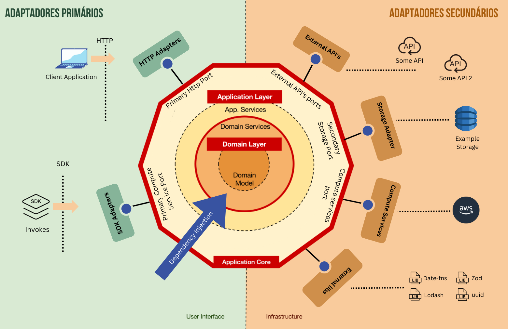

<br />

[(Voltar ao topo)](#tópicos)

<br />

Utilizamos algumas das seguintes tecnologias dentro do projeto:


<br />

## Executando o projeto no ambiente local

Para rodar o projeto localmente, basta seguir as instruções listadas abaixo. É importante se atentar ao que é obrigatório.

### > Instalação

Abaixo você pode acompanhar as instruções necessárias para executar esse projeto localmente.

1. Clone o repositório da API

   ```sh
   git clone https://github.com/gcmonteiro02/hexagonal-fastify-prisma-githubactions-gcp-template
   ```

2. Instale os pacotes do repositório da API utilizando o npm

   ```sh
   npm i
   ```

3. Configure as variáveis de ambiente para rodar o projeto localmente, elas ficam separados por ambiente, no seguinte diretório: [resources](resources)

   ```yml
   DATABASE_URL: ${value}
   PORT: ${value}
   GCP_PROJECT: ${value}
   GCP_SA_KEY: ${value}
   ```

4. Após a execução dos itens acima, é necessário executar o seguinte script:

   ```sh
   npm run dev
   ```

<br />

[(Voltar ao topo)](#tópicos)

## Como criar novas features no projeto utilizando o hexagonal?

<br />

Nesse projeto utilizamos a arquitetura Hexagonal para implementar e gerir features. Para realizar a criação ou a manutenção de uma feature dentro desse repositório, é necessário possuir um conhecimento pelo menos inicial sobre arquitetura Hexágonal, para mantermos o objetivo dessa arquitetura em dia.

Vamos realizar um exemplo prático de inserção de uma nova feature, para que possamos acompanhar o passo a passo do que achamos que é ideal:

### Feature: Buscar um novo User no banco.

Podemos pensar um pouco sobre essa feature antes de executar a construção dela. Diante disso, aqui cabem alguns casos a se pensar:

- _De onde vem a solicitação de busca do usuário?_

  Se por exemplo, a requisição de busca for solicitada diretamente de um dos nossos clients e a comunicação for via HTTP Rest, então podemos adicionar ao adaptador primário ([src/adapter/primary/http/rest](src/adapter/primary/http/rest/user/routes.ts)), onde esse adaptador vai realizar a comunicação interfaceada com as portas responsável por essa comunicação com a camada da aplicação/serviços ([src/core/domain/user/port](src/core/domain/user/port.ts)). Em suma, todos as aplicações que precisarem se conectar na nossa API vão ser destinadas ao lado esquerdo do Hexágono, ou seja, serão sempre adaptadores primários. Basicamente esses adaptadores primários são os nossos usuários, sejam eles clientes finais, produtos que precisam de acesso na nossa API e até mesmo CLI's dependendo do caso. Portanto, novamente, tudo que se conecta à nossa aplicação e demanda dados, podem ser considerados adaptadores primários.

<br />

- _Precisamos manipular o dado do usuário? por exemplo, formatá-lo para um modelo diferente..._

  Entendemos nesse exemplo que isso faz parte da regra de negócio da aplicação, então essa condição precisa estar dentro da camada de aplicação, mais precisamente na camada de serviços e domínio, é onde ficam as regras de negócio da aplicação ([src/core/domain/user/service](src/core/domain/user/service.ts), [src/core/domain/user/user](src/core/domain/user/user.ts)).

  Dessa forma, o adaptador primário, que no nosso caso é o client (frontend app que o consumidor final está utilizando) vai realizar a comunicação através das portas e e atingir através delas as camada de serviços e domínios, respeitando estritamente o que as portas dizem.

  O fluxo de uma requisição dentro da arquitetura Hexágonal é geralmente partindo do adaptador primário, passando pela camada de aplicação e chegando nos adaptadores secundários, após esse trajeto, temos o retorno dessa requisição em forma de resposta para o adaptador primário que realizou a ação.

  Voltando para nossa resposta sobre a nossa pergunta, a formatação do dado acontece dentro da camada de aplicação, mais precisamente na camada de serviços, por se tratar de uma regra de negócio.

  Precisamos sempre manter a regra de negócios dentro da camada de aplicação, pois lembrando aqui, os adaptadores são substituiveis, por esse motivo precisamos deixar a nossa regra de negócios isolada.

  Respeitando esse comportamento descrito acima, garantimos que sempre estaremos recebendo o que esperamos, pois as portas se responsabilizam pelos dados que a camada de aplicação precisa.

  Independente de quem se conecta na camada de aplicação (seja qual for o adaptador primário, se ele não respeitar as portas, o mesmo não se conecta na nossa aplicação). Qualquer adaptador secundário pode ser substituído facilmente, pois o seu sucessor precisará apenas implementar as portas que o anterior implementava.

<br />

- _Precisamos salvar um log dentro da aplicação, registrando que essa busca foi realizada pelo nosso client, e aí?_

  Aqui estaremos falando sobre os adaptadores secundários ([src/adapter/secondary](src/adapter/secondary)). Os adaptadores secundários são vistos como a parte de infraestrutura da aplicação, portanto, dentre eles estão os bancos de dados, filas, libs e assim por diante.

  Se nós precisamos salvar um log dentro do banco, então teremos que fazer com que a nossa camada de aplicação solicite aos adaptadores secundários a execução dessa atividade.

  A requisição arte do adaptador primário, passa pelas portas, atinge a camada de aplicação que por sua vez atinge o adaptador secundário.

  O benefício disso tudo descrito acima é que isso nos da a garantia de que esse adaptador secundário, ao respeitar as portas, está apto para executar tudo que a camada de aplicação precisa. Aqui segregamos o que é operação de infraestrutura e regra de negócios.

<br />

### Implementando a feature, passo a passo:

Podemos entender que o processo de criação de uma feature na arquitetura hexágonal nesse projeto consiste nos seguintes passos:

    1. Entender o que de fato precisamos criar para a nova feature
    2. Criar as portas e DTO's que são necessários
    3. Criar casos de teste para as portas e adaptadores (ideal)
    4. Criar os adaptadores e implementar as portas que foram estabelecidas por eles
    5. Realizar a comunicação dos adaptadores com as portas e também das camadas de serviço com os adaptadores
    6. Ajustar a tipagem de pré-configuração da aplicação, o que ela vai precisar para atender a nova feature (novos adaptadores primários e secundários e etc...)
    7. Criar a documentação dos adaptadores

<br />

Começando:

1. Vamos supor que o domínio User ainda não existe dentro da aplicação, portanto vamos cria-lá no path [src/core/domain](src/core/domain) :

   <br />

   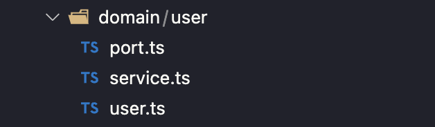

   <br />

   Os domínios por definição possuem pelo menos um arquivo, sendo ele o próprio que o representa. No caso de User, temos: `user.ts `. Isso porque um domínio pode não possuir regras de negócios, mas existir dentro da aplicacão e fazer parte de outras regras de negócio.

   No nosso exemplo, criaremos também o arquivo `port.ts ` e `service.ts `, que vão representar respectivamente as portas do domínio User (utilizadas pelos adaptadores) e as regras de negócio do domínio User (geralmente DTO's). Esses arquivos se repetem entre os domínios.

   <br />

2. Após estruturar a pasta do domínio User, vamos criar agora as portas primárias e secundárias, e os respectivos DTO's que atuam dentro delas:

   O DTO nesse caso é o que a nossa porta `get` vai sempre requisitar para todos os adaptadores primários que tentarem se conectar a ela:

   <br />

   > (id: string)

   <br />

   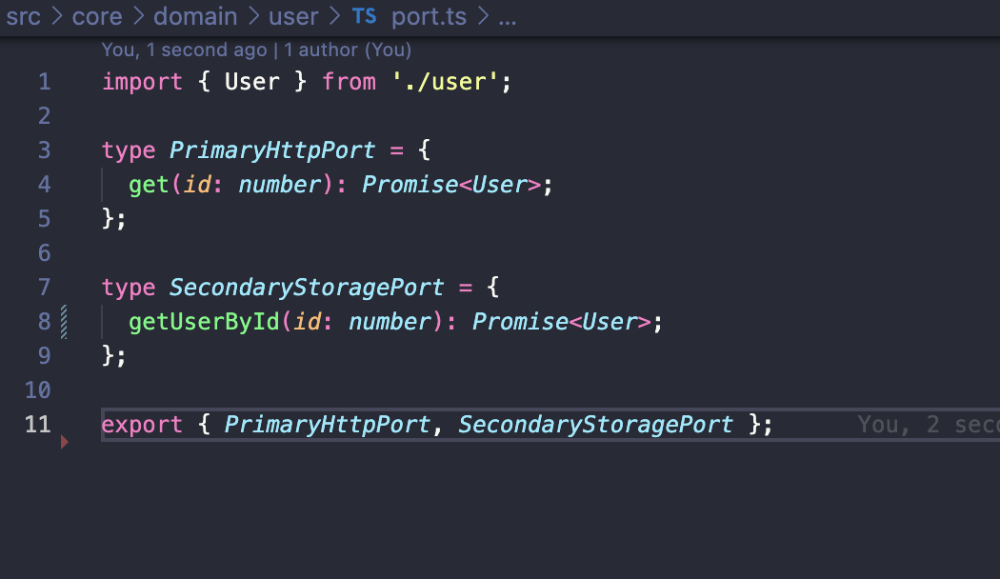

   <br />

   Temos o `PrimaryHttpPort`, que é a interface que representa as portas primárias que estão abertas para os adaptadores primários. No nosso caso estamos trabalhando com as portas do tipo HTTP/REST. Se tivermos outra necessidade, por exemplo outros tipos de adaptadores primários se conectando ao nosso domínio User, então teremos que ter interfaces separadas para representar essas outros portas, por exemplo `PrimaryCLIPort`, onde essa porta terá apenas os métodos correspondentes a necessidade desse tipo de adaptador primário.

   Outro detalhe que podemos observar é o retorno dessa porta, ela por si só já avisa o que exatamente a mesma vai devolver após ser acionada, trabalhando numa espécie de <I,O>. A visualização fica bem mais clara em relação ao que temos de regra de negócio implementado. Assim como a manutenção, pois para um novo desenvolvedor que está chegando ao projeto gerir as features, basta ele se atentar a quais portas existem e o que as mesmas esperam de Input e devolvem de output.

   Nessa feature, também vamos realizar uma busca no banco, portanto precisamos fazer a criação das portas secundárias, essas que vão ser utilizadas pelos adaptadores secundários. Vamos criar uma interface chamada por exemplo `SecondaryStoragePort` com o método chamado `getUserById`, para representa-las:

     <br />

     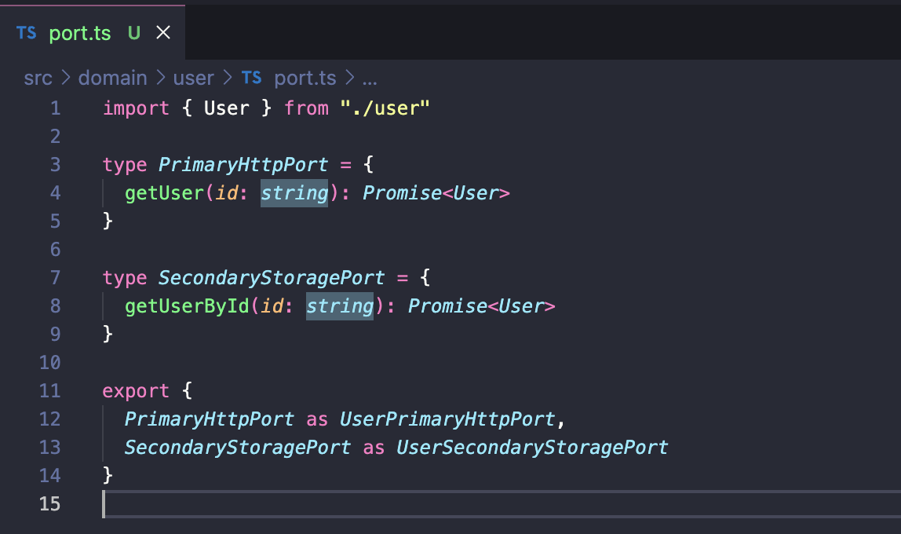

     <br />

   Portanto, futuramente exigiremos através dessa porta secundária, representada por essa interface `SecondaryStoragePort` que os adaptadores secundários que se conectarem a nossa aplicação implementem essas portas, que por sua vez são representadas pelos nossos métodos. O adaptador secundário vai ser do tipo Storage, pois precisamos do banco para reter as informações dos usuários.

   Seguindo o mesmo conceito das portas primárias, se caso tivermos outro contexto dentro dos adaptadores secundários que atingem o domínio `User`, teremos que criar outras portas separadas. Um exemplo seria se precisassemos enviar o user para para uma fila, então teriamos de criar uma interface chamada por exemplo `UserSecondaryMessageQueuePort` para representar apenas as portas que são destinadas a esse adaptador secundário em específico.

     <br />

3. Após a criação das portas primárias e secundárias e também dos DTO's, já temos recursos suficientes para criarmos por exemplo, casos de teste. Com isso, basta importar as portas e os DTO's para defini-los, visto que estamos programando voltado para a interface e não para os métodos. Porém, nesse exemplo, não criaremos os casos de testes a fim de agilizar o exemplo prático.

   <br />

<!-- [(Voltar para cima)](#tópicos) -->

4. Agora o próximo passo é implementar as portas na camada de serviço:

   <br />

   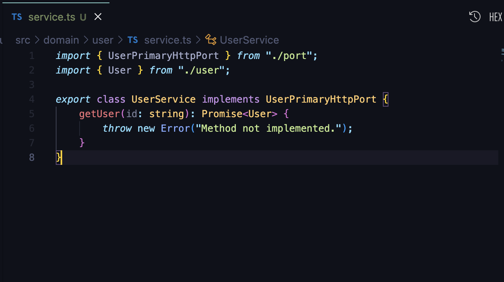

   <br />

   A classe `UserService` implementa as portas contidas na `UserPrimaryHttpPort`. Dessa forma, a interface que representa as portas vai exigir que essa classe implemente os métodos que foram criados, no caso, as próprias portas. Uma vez que os adaptadores primários sofrerem a injeção de dependência da `UserService`, vamos garantir que os mesmos tenham acesso as portas que precisam, e em paralelo a isso vamos garantir a passagem dos DTO's que são definidos pelas portas.

   <br />

5. Agora vamos fazer com que o nosso adaptador secundário realize a implementação das portas secundárias. Isso porque precisamos garantir que eles implementem as portas secundárias que a nossa camada de aplicação precisa para poder funcionar. Lembrando que para esse exemplo, essas portas são a representação dos métodos de banco, no caso de de leitura, escrita e entre outros.

   Após realizar o export da `SecondaryStoragePort`, vamos fazer com que o adaptador secundário, no nosso caso, o `ExampleStorage` [src/adapter/secondary/storage/example/ExampleStorage.ts](src/adapter/secondary/storage/example/ExampleStorage.ts) que foi escolhido para se conectar na aplicação a respeite. Veremos que o nosso adaptador secundário ja implementa outra porta de outro domínio, basta adicionar mais uma.

   <br />

   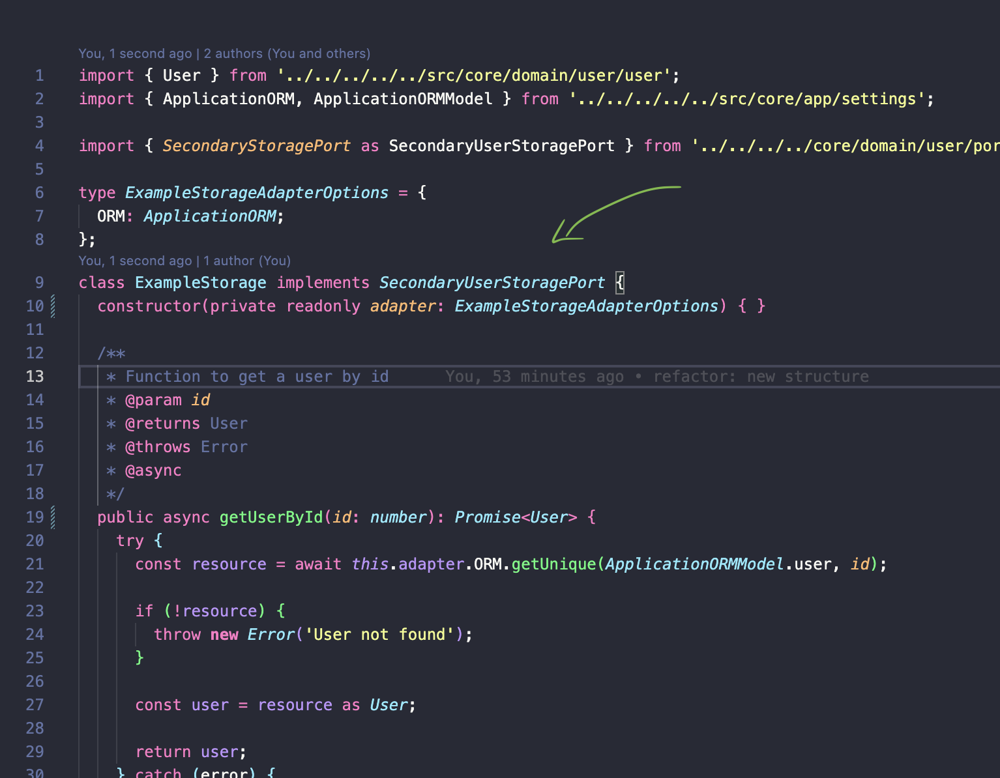

   <br />

   Agora o `ExampleStorage`, adaptador secundário, implementa as portas que a interface `SecondaryStoragePort` representa (portas essas que são ditadas pela nossa camada de aplicação).

   <br />

   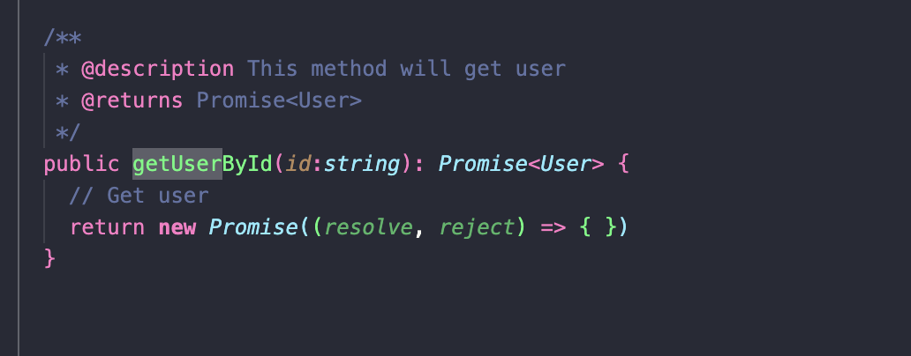

   <br />

   Dessa forma a classe implementa os métodos dessa interface e garante que a mesma vai atender o que a nossa camada de aplicação precisa.

   Agora basta fazer a nossa camada de serviço se contatar com os adaptadores secundários, através de injeção de dependência e utilizando as portas.

   <br />

   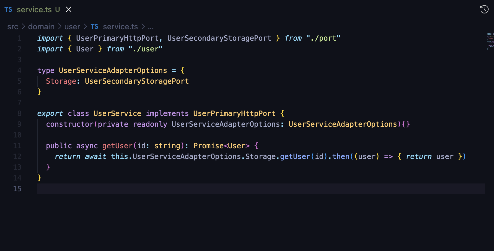

   <br />

   Para seguirmos o exemplo, adicionei uma pequena regra de negócio, a qual deve estar na camada de serviço:

    <br />

    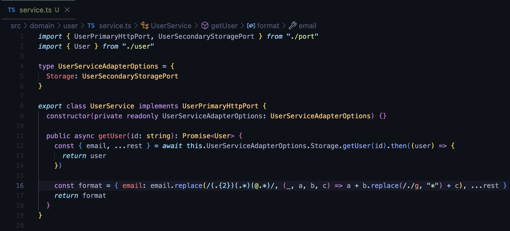

    <br />

6. Agora que temos as portas primárias e secundárias, DTO's, e adaptadores secundários prontos, podemos criar os adaptadores primários que vão ser os protagonistas em relação ao uso de todos esses itens [src/adapter/primary/http/rest/user](src/adapter/primary/http/rest/user):

   <br />

   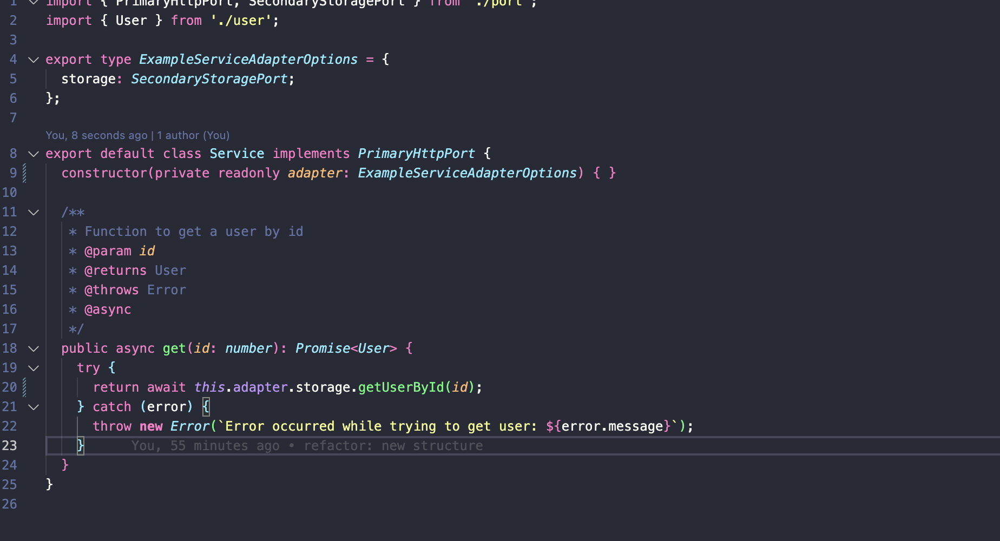

   <br />

7. Após toda essa estruturação, precisamos ainda realizar a injeção de dependência e tipar os novos adaptadores na aplicação.

   Essa "tipagem" se faz necessária para que a nossa aplicação tenha como uma "definição" o que ela espera receber de adaptadores primários e secundários para funcionar.

   Dessa forma, evitamos que a remoção de algum adaptador exigido pela aplicação seja feito e a mesma eventualmente quebre em alguma execução que exija esse adaptador.

   A ideia é fazer com que antes que seja iniciada, a aplicação tenha tudo o que precisa a nível de configuração, isto é:

   1. Adaptadores primários
   2. Adaptadores secundários
   3. Configurações de environment

   <br />

   Então, para fazermos isso, basta alterarmos o arquivo [src/core/app/index.ts](src/core/app/index.ts), que faz a junção de todas as camadas da nossa estrutura hexágonal:

<br />

8. Alterando a tipagem de configuração da aplicação [src/core/app/settings.ts](src/core/app/settings.ts):

   <br />

   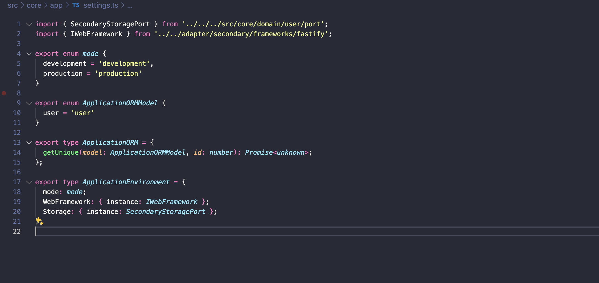

   <br />

   Nesse arquivo é onde mantemos a exigência do que vai entrar na aplicação. Portanto, como estamos criando um novo domínio, precisamos inserir o mesmo ali dentro.

   Assim como se fossemos precisar de uma nova lib, ou um novo adaptador secundário por exemplo, precisariamos indicar nas tipagens de configuração da aplicação pois tudo é feito através de injeção de dependência.

   O principal benefício disso é o desacoplamento entre os adaptadores e a camdada de aplicação. Se um dia precisarmos alterar uma lib por exemplo que está sendo injetada na aplicação, precisamos apenas substitui-la na própria classe dela. Isso evita refatorações em massa.

   <br />

9. Portanto, agora vamos realizar de fato a injeção de dependência [src/core/app/index.ts](src/core/app/index.ts):

   <br />

   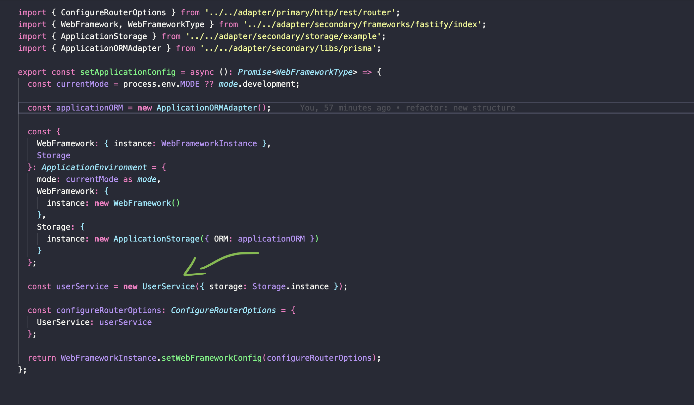

   <br />

E assim finalizamos o processo de criação de uma feature.

<br />

[(Voltar ao topo)](#tópicos)

<br />

### Como criar um adaptador primário no projeto utilizando o Hexagonal?

To do

<br />

[(Voltar ao topo)](#tópicos)

<br />

### Como criar um adaptador secundário no projeto utilizando o Hexagonal?

To do

<br />

[(Voltar ao topo)](#tópicos)

<br />

### Padrão de versionamento

Esse repositório utiliza o `Trunk Based Development` como padrão de versionamento no repositório.

<br />

- [O que é Trunk Based Development?](https://trunkbaseddevelopment.com/)

<br />

[(Voltar ao topo)](#tópicos)

<br />

### Débitos técnicos

Os débitos técnicos são listados em forma de issues no próprio Github. Por favor, para listar os débitos técnicos, utilize a aba issues desse repositório e a label `Technical Debt`

<br />

[(Voltar ao topo)](#tópicos)

<br />

### Devops

Atualmente contamos com o Github Actions para realizar o deploy do projeto. Hoje temos os seguintes ambientes disponibilizados:

    1. HML
    2. PRD

É necessário configurar as envs do GCP para atrelar o actions ao GCP.

<br />

[(Voltar ao topo)](#tópicos)

<br />

### Contribuidores

<br />

<table>
    <td align="center" valign="top" width="14.28%">
      <a href="https://www.linkedin.com/in/gcmonteiru/"><br /><sub><b>Gabriel Monteiro</b></sub></a><br />
      </td>
</table>

<br />

[(Voltar ao topo)](#tópicos)

<br />
